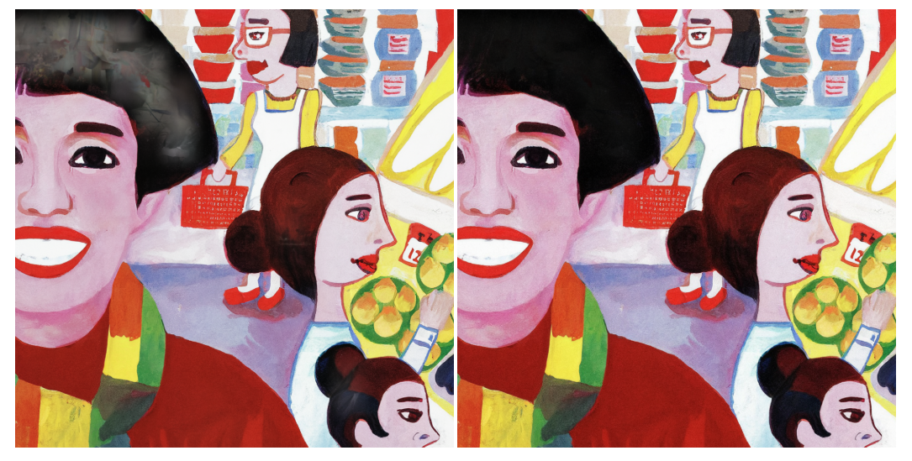

# Upscaler

This project is a generative image upscaling pipeline. It uses Stable Diffusion to perform a 4x upscale in tiles, followed by an "adaptive fusion" step that suppresses hallucinations in flat, untextured areas.

<p align="center">
  
  <br>
  <em>Comparison of a 16x upscale: Original image with target region in blue (left), Standard Bicubic upscale (center), Generative Upscale + Adaptive Fusion (right). Not perfect, but you get the idea :)</em>
</p>

## Hardware Requirements

**A dedicated GPU (NVIDIA with CUDA support) is strongly recommended.** The `stable-diffusion-x4-upscaler` is a large model (the weights are several gigabytes). While running on a CPU is technically possible, it will be prohibitively slow. 

Because the script processes the image in tiles, it is relatively memory-efficient, but a GPU with at least **8GB of VRAM** is recommended. If you encounter out-of-memory (OOM) errors, try reducing the `--tile-size` parameter in Step 1.

## Main Workflow

### 0. Setup

Install dependencies using `uv`:

```bash
uv sync
```

### 1. Generative Upscale

Place your low-resolution seed image in the `input_images` directory. Run the tiled diffusion upscaler, which slices the image, upscales it 4x using `stable-diffusion-x4-upscaler`, and stitches it back together.

The output of this step can be fed in to itself again for even more dramatic upscaling. Since each pass does a 4x upscale, expect processing time to grow at roughly 16x on each pass. It's strongly suggested to visually inspect the output after each step, and run `4_compare_size.py` to keep an eye on progress toward your desired final size.

There are two versions of the upscaler script available. It is recommended to try both to see which yields better results for your specific image:
- `1_tiled_upscale_v2.py`: Blends the tiles in latent space before doing a single VAE decode pass.
- `1_tiled_upscale.py`: Blends the tiles in pixel space after decoding.

```bash
# Using v2 (latent space blending)
python 1_tiled_upscale_v2.py --input my_image.png --output upscaled.png \
  --prompt "describe your image here to guide the AI" \
  --negative-prompt "blurry, artifacts, distortion, deformed text, watermark, low quality, noisy, smudged, canvas texture"

# Or using v1 (pixel space blending)
python 1_tiled_upscale.py --input my_image.png --output upscaled.png \
  --prompt "describe your image here to guide the AI" \
  --negative-prompt "blurry, artifacts, distortion, deformed text, watermark, low quality, noisy, smudged, canvas texture"
```

**Key Parameters to Tune:**

- `--prompt`: Describe the image to guide the AI's generation.
- `--negative-prompt`: What the AI should avoid generating.
- `--noise-level` (default: 10): How much noise to add before denoising. Higher values allow the AI to change the image more (adding more details but potentially hallucinating). Lower values stick closer to the original image.
- `--guidance-scale` (default: 4.0): How strongly the AI should follow your text prompt.
- `--steps` (default: 50): Number of denoising steps. More steps generally yield higher quality but take longer.
- `--tile-size` (default: 128): Size of the tiles processed. Larger tiles require more VRAM.
- `--overlap` (default: 32): How many pixels tiles overlap for blending. Higher overlap reduces visible seams but increases processing time.
- `--sample`: Provide a bounding box `x,y,w,h` in input pixels (e.g., `--sample 100,200,200,200`) to only upscale a specific sub-region. This is highly recommended for quickly iterating on prompts and parameters in problematic areas before running a full-image upscale.

### 2. Adaptive Fusion (Fixing Hallucinations)

Stable Diffusion tends to hallucinate unwanted textures in flat areas (like skies, smooth walls, or skin). The `2_adaptive_fusion.py` script fixes this by intelligently blending the AI-upscaled image with a simple bicubic upscale of your original image. 

It calculates a "local variance map" to detect flat vs. textured areas. You are provided with knobs to control this blend, allowing you to weigh the highly-detailed AI hallucinations against the lower-res ground truth structure and color features. It retains the generated details in highly textured regions but falls back to the clean bicubic upscale in flat areas.

```bash
python 2_adaptive_fusion.py --original my_image.png --upscaled upscaled.png --output final_fused.png
```

*Example: Compare the raw Stable Diffusion output (left), which may have hallucinations in flat areas, with the fused result (right), where flat areas are cleaned up.*

<p align="center">
  

**Key Parameters to Tune:**

- `--var-p-low` (default: 35.0): The variance percentile below which the script completely trusts the base (bicubic) image. Increase this to suppress more hallucinations in moderately flat areas.
- `--var-p-high` (default: 85.0): The variance percentile above which the script completely trusts the AI-upscaled image. Decrease this to allow AI details in less textured areas.
- `--min-detail-weight` (default: 0.15): The minimum amount of AI detail to keep even in the flattest regions.
- `--max-detail-weight` (default: 0.85): The maximum amount of AI detail to keep in the most textured regions.
- `--blur-radius` (default: 4.0): How much to blur the blend mask to ensure smooth transitions between AI and base image areas.
- `--sample`: If you used `--sample` in Step 1 to generate a sub-region, pass the **exact same** `x,y,w,h` string here. The script will automatically detect that the upscaled image is a crop and fuse it correctly against the corresponding crop of the original image.

### 3. Add a Border (Optional)

If you need to add a uniform white border around your final image, for example if you plan on framing it and dont want the edges covered, you can use the `3_add_border.py` script. The script assumes the input file is in the `output_images` directory. The percentage parameter dictates the border thickness relative to the image's largest dimension.

```bash
# Adds a 10% border
python 3_add_border.py final_fused.png 10
```

*Tip: Add `--dry-run` to output an image with a black outline so you can easily inspect the border thickness against white backgrounds in image preview apps.*

### 4. Utilities

#### Compare Sizes

Run the `compare_size.py` script to see the final effect of your upscaling. If you're intending to print the image, the final size should be at LEAST the necessary resolution/dpi for the physical size you're planning.

```bash
python 4_compare_size.py input_images/my_image.png output_images/final_fused.png
```

## License

The code in this repository is licensed under the **MIT License**. 

**Note on Model Weights:** This project downloads and uses the `stabilityai/stable-diffusion-x4-upscaler` model. These model weights are licensed under the [CreativeML Open RAIL-M](https://huggingface.co/spaces/CompVis/creativeml-openrail-m) license, which includes specific use-case restrictions (e.g., prohibiting the generation of illegal or harmful content). By using this pipeline, you agree to abide by the terms of that license.

